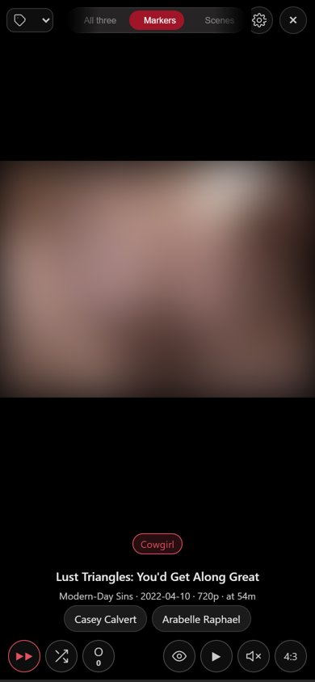

# tpdbarr

ThePornDB scenes into Whisparr v2, checked against Stash. The v2/TPDB
counterpart to [stasharr](https://github.com/enymawse/stasharr), which does the
same job for StashDB and Whisparr v3.

- **[portal/](portal/)** — a self-hosted container with its own UI. This is the
  one to use.
- **[tpdbarr.user.js](tpdbarr.user.js)** — a userscript that adds the button to
  theporndb.net pages.
- **[fileflows/](fileflows/)** — optional FileFlows flows that encode scenes
  before Stash files them.

## An overlay on Stash, not a replacement

Stash stays your library. The portal reads it live over GraphQL, writes its
changes back to Stash, and plays files from the folders Stash already uses. Its
own state is one `config.json`. Stop the portal and Stash carries on as before.

## The Feed — your markers, like TikTok



Every Stash scene marker becomes a full-screen clip you swipe through.

- Swipe up (or ↓ / `j`) for the next clip; swipe sideways (or ← / →) to change
  feed. Drag to scrub, Space pauses.
- Clips are cut at 720p from the source. Stash's own are 640x360.
- Five feeds: *Markers*, *Scenes*, *RedGIFs*, *Reddit*, or *All three* mixed.
- Filter by tag, shuffle, auto-advance, Fit or 4:3.
- Your settings are kept on the server, so phone and desktop agree.

Open it from **Feed** in the top bar, or `#/binge`.

<br clear="right" />

## What's in it

Two tabs: **Library**, and **Manage**, a menu holding **Performers**, **Studios**, **Stats**, **Find**, **Catalogue** and **Settings**.
Pictures in the screenshots are blurred on purpose.

### Library — browsing what you have


- **Overview**: the Feed, industry news, Continue watching, and what's new.
- **Scenes, Performers, Studios, Galleries** share one filter bar.
- **Every tile shows its status and resolution.** Red is over your target
  resolution, yellow is not finished, green is filed and at target.
- **Hover a tile** to play its preview. Run the mouse along the bottom to scrub.
- **Scene page**: player and controls on the left, details on the right. Drag
  the picture to scrub.
- **Scale a file down** to 1080p, 720p or 480p. The original is only deleted
  once the new file checks out.
- **Performer and studio pages** fill Stash's blanks from IAFD or the ThePornDB
  mirror, and can write just the gaps back.
- **Categories**: shelves you arrange, with hand-picked scenes and a rule. A
  filmography category tracks a director's work, owned or missing.
- **Movies**: full-length features read from Emby's .nfo files.
- **Galleries**: build Stash galleries from pictures found on the web.
- **TV**: channels (random, movies, category, studio, performer, tag) that play
  scenes back to back, live, so you join part-way through.

### Stats — how the collection is doing


- The pipeline as one bar: downloaded, editing, encoding, filed, films.
- Small charts: added this month, 1080p or better, watched, identified, years.
- Unmonitors scenes Whisparr still holds after Stash has filed them.

### Find — what you're missing


- **Overview**: one percentage across every catalogue you track, plus
  suggestions.
- **Video**: search StashDB and ThePornDB and send to Whisparr. **Indexers**
  searches Prowlarr directly. **Monitored** lists what Whisparr still wants.
- **Tracked**: follow a studio, performer or tag. Mark each card **Want**,
  **Skip** or **Have**.
- **Images**: gallery pages for a performer.
- **Integrations**: which services answered, and backups.

### Catalogue — fixing the records


- **Overview**: scenes with no stash id, no cover, not organised or no markers.
- **Match**: one search asks every stash-box and scraper at once. Exact
  fingerprint hits and matching artwork come pre-ticked.
- **Wild Card**: for scenes no fingerprint knows. Stash's scrapers read the URLs
  you give it, and you pick each field.
- **Group Builder**: finds films your loose scenes add up to.
- **Marker Builder**: cut markers by hand.
  - `t` point, `i`/`o` in and out, arrows step, `+`/`−` zoom.
  - *Frames* (`g`) drills from the whole scene down to the second.
  - *Sharpen strip* cuts a picture a second so the timeline is exact.
  - Works on a phone. Fetches markers from timestamp.trade and ThePornDB.

### Settings — connections and long jobs


- **Connections**: Stash, both Whisparrs, Prowlarr, NZBGet, FileFlows.
- **Stash jobs**: scan, generate, rename to `Studio/date.Title`, write `.nfo`
  files. Each shows its plan first.
- **Catch up**: fills blanks on identified scenes. It never overwrites.

<details>
<summary><b>Every screenshot</b></summary>

#### Library

**Overview**


**Scenes shelf**


**Performers**


**Studios**


**Movies**


**Galleries**


**Categories**


#### Stats


#### Find

**Overview**


**StashDB search**


**Tracked**


**Images**


**Integrations**


#### Catalogue

**Overview**


**Match**


**Wild Card**


**Group Builder**


**Marker Builder**


#### Manage

**Connections**


**Stash jobs**


</details>

The portal has its [own README](portal/README.md). The rest of this file is
the userscript.

## Why v2

Whisparr v3 only takes scene metadata from StashDB
([Whisparr#515](https://github.com/Whisparr/Whisparr/issues/515)). It uses
ThePornDB for movies only. So TPDB scenes need Whisparr v2, run alongside v3.

## How it works

v2 is a Sonarr fork: a TPDB site is a series, a TPDB scene is an episode.

On a scene page the script:

1. reads the scene slug from the URL and the site slug from the page's links
2. `api.whisparr.com/v3/site/search?q=<site>` → TPDB site id
3. `GET /api/v3/series?tvdbId=<siteId>`, or add the site if it's missing
4. `api.whisparr.com/v3/site/<siteId>` → TPDB scene id
5. `GET /api/v3/episode?seriesId=<id>` → match on `tvdbId`
6. `PUT /api/v3/episode/monitor` → `POST /api/v3/command {name:"EpisodeSearch"}`

Sites are added with nothing monitored, so **only the scenes you click are
grabbed**. The script never writes to TPDB.

## Stash: "do I already have this?"

Optional. Give the script your Stash URL and API key and each scene page shows
whether you already have it.

1. **In Stash** (green): a scene carries the TPDB stash id.
2. **Probably in Stash** (orange): title and date match. Hover for the file path.

Click the pill to open the scene in Stash. For exact matching, add
`https://theporndb.net/graphql` as a stash-box endpoint in Stash and identify
your library against it.

## Install

1. Install Tampermonkey or Violentmonkey.
2. Import `tpdbarr.user.js` from the extension's dashboard.
3. Open a theporndb.net scene page and click **Set up tpdbarr** bottom-right.
4. Enter your Whisparr **v2** URL and API key, and optionally Stash's. Hit
   **Connect**, then **Save**.

## The button

| Colour | Meaning |
|---|---|
| purple | not in Whisparr — click to add |
| blue | monitored, searching or waiting |
| green | downloaded |
| red | failed — hover for the reason, click to retry |

The Stash pill: green in Stash, orange probably, grey not, dark red Stash
unreachable.

## Running v2 alongside v3

Give them different ports and different root folders.

```yaml
services:
  whisparr-v3:            # StashDB scenes + TPDB movies
    image: ghcr.io/hotio/whisparr:v3
    container_name: whisparr-v3
    ports: ["6969:6969"]
    volumes:
      - ./config/whisparr-v3:/config
      - /data/adult/stashdb:/data
    restart: unless-stopped

  whisparr-v2:            # TPDB scenes
    image: ghcr.io/hotio/whisparr:v2
    container_name: whisparr-v2
    ports: ["6970:6969"]
    volumes:
      - ./config/whisparr-v2:/config
      - /data/adult/tpdb:/data
    restart: unless-stopped
```

Share one Prowlarr and download client, with a category each.

## Known rough edges

- Site detection reads `/sites/<slug>` links off the page. A TPDB redesign
  could break it (`candidateSiteSlugs()`).
- The first add on a new site is slow while Whisparr pulls the catalogue.
- Scene catalogues are cached for 6h per site.
- Scene pages only. No bulk add.
